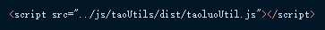
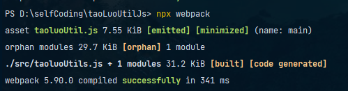

# taoLuoUtilJs
这是一系列自集成js方法，在对Dom元素 id class name等赋值取值时总要用jquery js 等指定的$ # . getElementID等特殊符号好生繁琐，  * todo             故而在想如果能像Java一样形成一系列常用方法提取出来进行方法调用，皆在简化获取值或者简化一些常用js操作，使用之前需要先引用jquery.js layui.js等前置JS
 
**使用方法：**

1. 在dist目录下直接下载js文件引用：

   
2. 更新重编译js文件：打包下载该源码，解压→命令行窗口进入到该文件主目录→输入执行命令npx webpack

